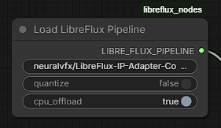
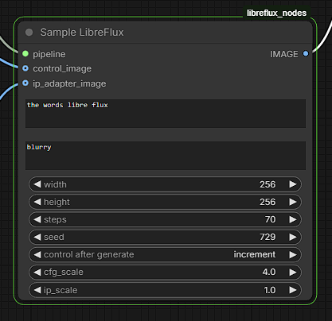

# LibreFlux ComfyUI Nodes

Custom nodes for running [LibreFlux](https://huggingface.co/neuralvfx/LibreFlux-IP-Adapter-ControlNet) with IP Adapter and ControlNet support in ComfyUI.

## Installation

1. Clone this repo
   ```bash
   git clone https://github.com/NeuralVFX/LibeFLUX-ComfyUI/
   ```
2. Install dependencies
   In your ComfyUI conda env:
   ```bash
   pip install protobuf optimum-quanto diffusers==0.35.2
   ```

3. Copy into comfyUI
   ```bash
   cp libreflux_nodes ComfyUI/custom_nodes
   ```

## Load LibreFlux Pipeline Node


Loads the LibreFlux model with IP Adapter and ControlNet.

**Inputs:**
- `model_path` — HuggingFace model ID (default: `neuralvfx/LibreFlux-IP-Adapter-ControlNet`)
- `quantize` — Enable INT8 quantization for lower VRAM usage
- `cpu_offload` — Enable CPU offloading for very low VRAM setups

**Outputs:**
- `LIBRE_FLUX_PIPELINE` — The loaded pipeline object


## Sample LibreFlux Node


Generates images using the loaded pipeline.

**Inputs:**
- `pipeline` — Connect from Load LibreFlux Pipeline
- `prompt` — Text description of the image to generate
- `neg_prompt` — Negative prompt (what to avoid)
- `width` / `height` — Output dimensions (used when no control image provided)
- `steps` — Number of inference steps
- `seed` — Random seed for reproducibility
- `cfg_scale` — Classifier-free guidance scale
- `ip_scale` — IP Adapter influence strength
- `control_image` *(optional)* — ControlNet guide image
- `ip_adapter_image` *(optional)* — Reference image for IP Adapter

**Outputs:**
- `IMAGE` — Generated image

## Example Workflow

<!-- Add your workflow screenshot here -->

## Requirements

- ComfyUI
- Libraries:
  - protobuf
  - optimum-quanto
  - diffusers==0.35.2
- 55 GB VRAM ( with no optimization )
- 25 GB VRAM ( with **cpu offloading** and **quantize** )


